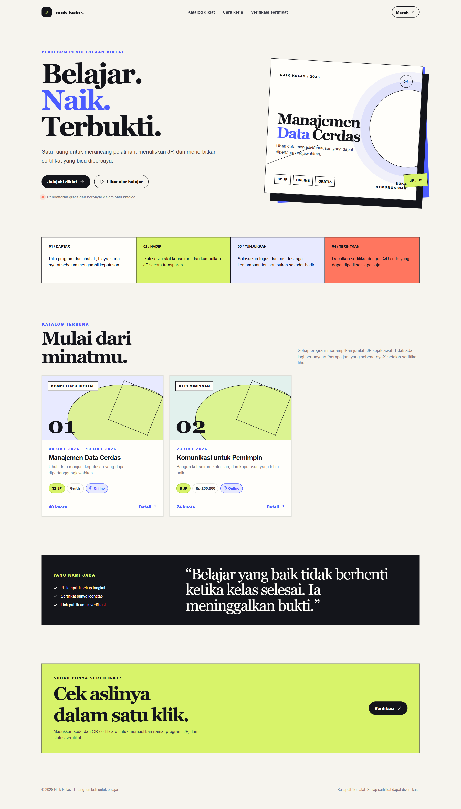
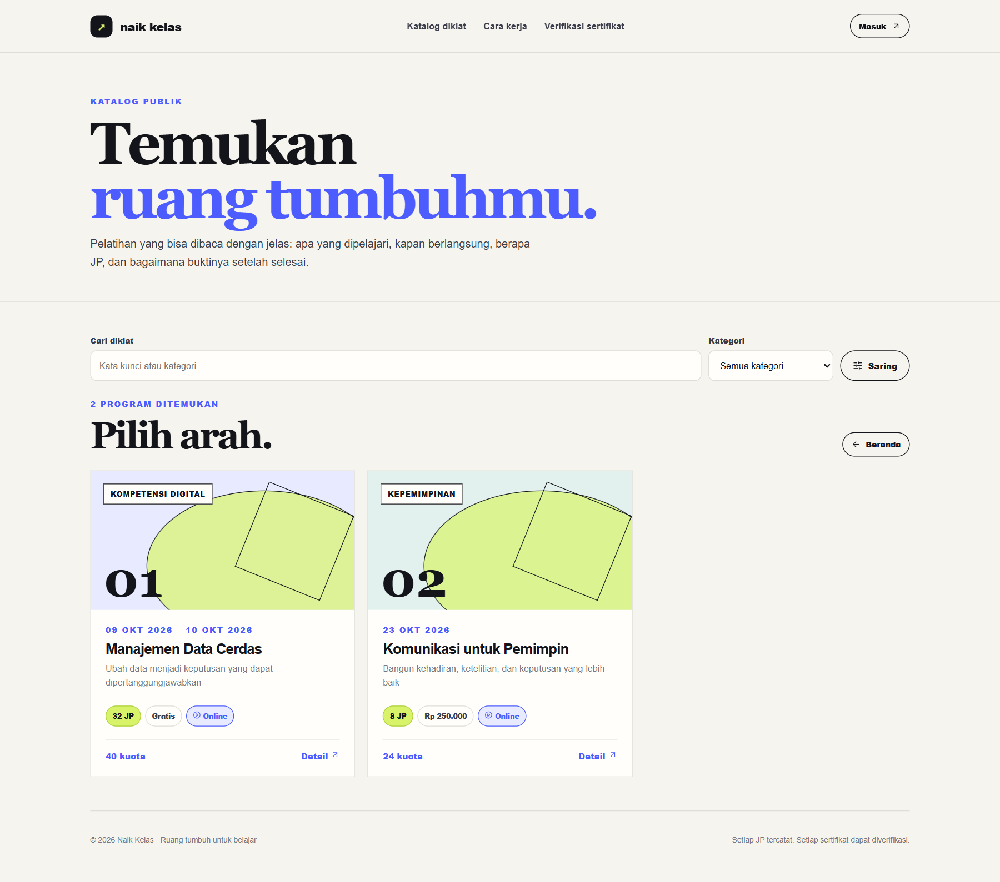
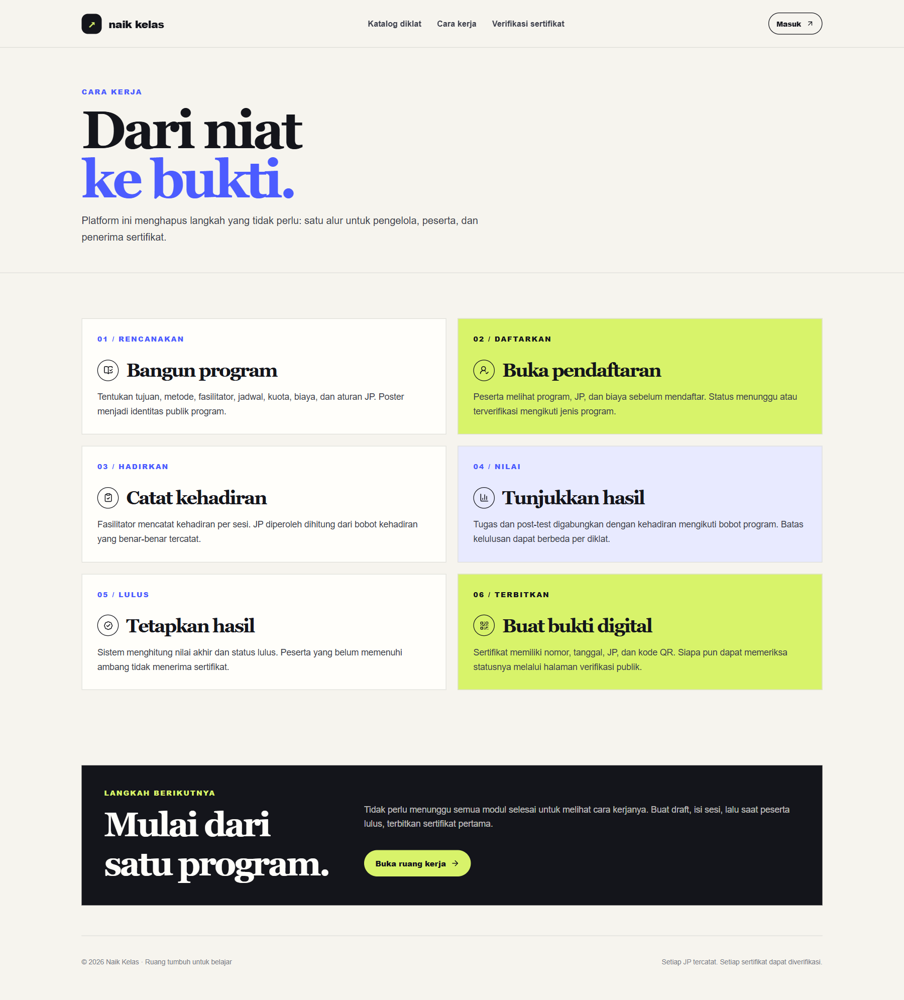
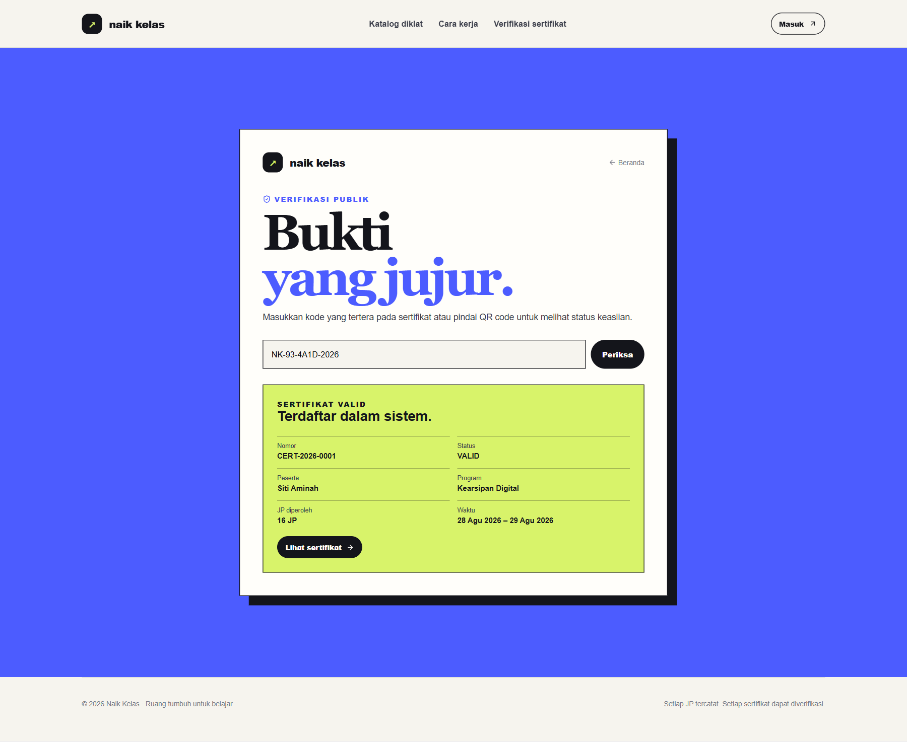
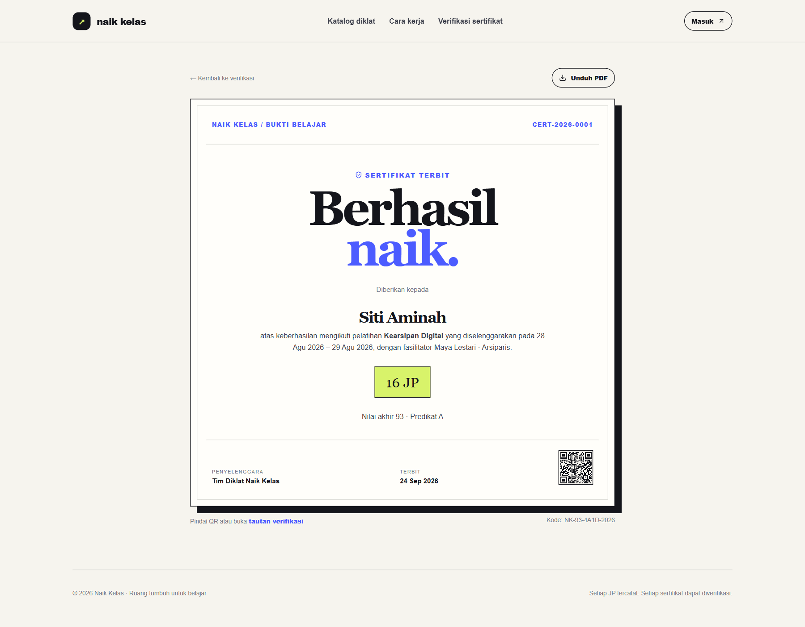

# Naik Kelas — Platform Diklat

Platform web untuk mengelola diklat dari draft, pendaftaran, pelaksanaan, penilaian, hingga sertifikat yang dapat diverifikasi publik.

> Dibangun dengan Next.js App Router, TypeScript, SQLite, dan session berbasis cookie tertanda tangan.

## Screenshot

### Beranda



### Katalog diklat



### Alur pengelolaan



### Verifikasi sertifikat



### Sertifikat digital



## Fitur

- **Katalog publik** — pencarian, filter kategori, poster, biaya, kuota, jadwal, fasilitator, dan total JP.
- **Pendaftaran** — peserta mendaftar dan memantau status verifikasi dari dashboard.
- **Manajemen draft** — admin membuat draft, menambahkan sesi, lalu menerbitkan ketika JP valid.
- **Sesi manual** — Mendukung Zoom, Google Meet, Microsoft Teams, platform lain, dan onsite tanpa integrasi Zoom API.
- **JP end-to-end** — JP tersedia di katalog, form pendaftaran, sesi, absensi, dashboard peserta, dan sertifikat.
- **Absensi** — status hadir, terlambat, izin, atau alpa; JP diperoleh dihitung otomatis.
- **Penilaian** — bobot kehadiran, tugas, dan post-test dapat dikonfigurasi per program.
- **Kelulusan** — nilai minimum dan minimum JP wajib hadir diterapkan di layer repository, bukan hanya UI.
- **Sertifikat** — nomor berurutan, kode acak, QR code, halaman publik, dan unduhan PDF.
- **Role-based access** — Super Admin, Admin, Fasilitator, Verifikator, Pimpinan, dan Peserta.
- **Dashboard** — statistik, agenda sesi, program terbaru, peserta, laporan, dan riwayat sertifikat.
- **Pengaman** — password hashing `scrypt`, cookie `HttpOnly`, validasi input, pembatasan seed demo di production, escape SVG, dan pencabutan sertifikat otomatis saat data berubah.

## Stack

| Komponen | Teknologi |
| --- | --- |
| Web | Next.js 16 App Router + React 19 |
| Bahasa | TypeScript 5.9 |
| Database | SQLite + `better-sqlite3` |
| Validasi | Zod |
| QR code | `qrcode` |
| PDF | `jsPDF` |
| UI | CSS custom + Lucide React |
| Test | Vitest |
| Build | Next.js webpack build |

## Menjalankan lokal

Kebutuhan: Node.js 20.9+ dan npm.

```bash
npm install
cp .env.example .env.local
```

Untuk development lokal, ubah `APP_URL` di `.env.local`:

```env
APP_URL=http://localhost:3000
```

Lalu jalankan:

```bash
npm run dev
```

Buka `http://localhost:3000`.

### Akun demo lokal

Data contoh hanya dibuat jika `SEED_DEMO_DATA=true` dan `NODE_ENV` bukan `production`.

| Role | Email | Password |
| --- | --- | --- |
| Super Admin | `admin@diklat.local` | `Demo123!` |
| Peserta | `peserta@diklat.local` | `Demo123!` |

Jangan gunakan akun contoh atau kredensial tersebut di production.

## Konfigurasi environment

| Variabel | Keterangan |
| --- | --- |
| `APP_URL` | Origin publik untuk QR sertifikat. Wajib HTTPS pada production. |
| `DATABASE_PATH` | Lokasi file SQLite. |
| `STORAGE_PATH` | Lokasi penyimpanan lokal. |
| `SEED_DEMO_DATA` | `true` hanya untuk data demo development. |
| `AUTH_SECRET` | Secret penandatangan session, minimal 32 karakter pada production. |

## Database dan seed

Default database development:

```text
data/diklat.sqlite
```

Pada production, gunakan volume persisten untuk SQLite beserta file `-wal` dan `-shm`. Jangan menyimpan state mutable di dalam image build.

## Perintah verifikasi

```bash
npm run lint
npx tsc --noEmit
npm test
npm run build
```

`npm run build` menggunakan webpack karena build Turbopack Next.js 16.3.6 mengalami panic source-map pada workspace ini.

## Struktur penting

```text
src/app/                  # halaman publik, dashboard, API route
src/components/           # komponen UI dan client actions
src/lib/schema.sql         # skema SQLite
src/lib/db.ts              # koneksi, migrasi ringan, dan seed demo
src/lib/repository.ts      # query dan mutasi domain
src/lib/actions.ts         # server actions tervalidasi
src/lib/security.ts        # password, session, redirect safety
src/lib/training-management.ts # draft, sesi, publish, assignment
docs/                      # screenshot README
```

## Deployment

Build image standalone:

```bash
npm ci
npm run build
node .next/standalone/server.js
```

Production membutuhkan:

1. `APP_URL` HTTPS yang benar-benar dapat diakses publik.
2. `AUTH_SECRET` acak minimal 32 karakter.
3. `DATABASE_PATH` dan `STORAGE_PATH` pada volume persisten.
4. `SEED_DEMO_DATA` tidak efektif pada production.
5. Backup volume SQLite sebelum deployment.

## Batas MVP

- Meeting dikelola manual; tidak ada Zoom API/OAuth/Webhook.
- Payment, notifikasi WhatsApp/email, LMS, bank soal, dan tanda tangan elektronik belum diintegrasikan.
- Sertifikat otomatis dicabut ketika absensi atau nilai berubah; data harus disetujui dan sertifikat diterbitkan ulang.

## Lisensi

Belum ditentukan. Tambahkan lisensi repository sebelum rilis publik.
